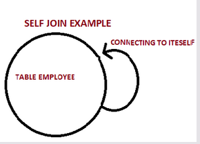
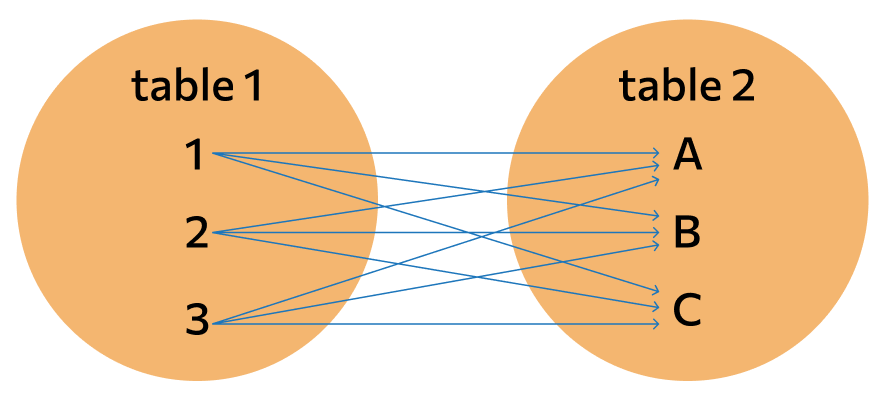
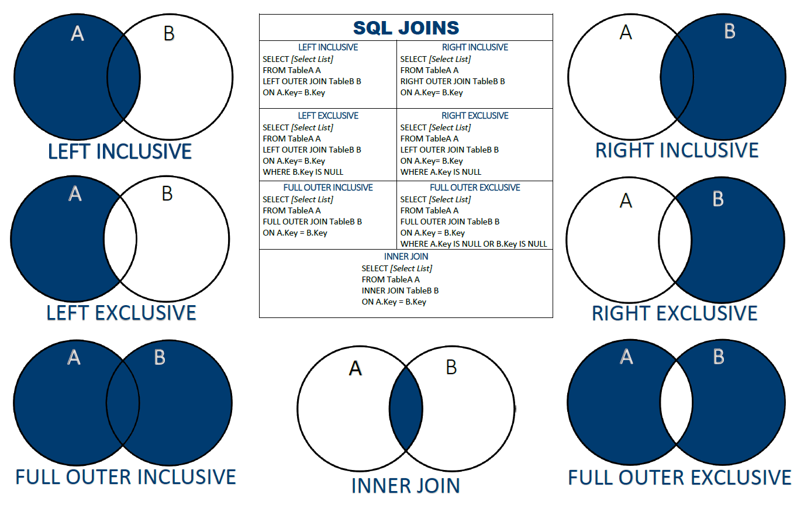

# AutoserviceSQL
Postgresql DATABASE autoservice 

#**Конспект по основным темам SQL**

##**Join SQL. Операции горизонтального соединения таблиц.**
SQL Join помогает настроить фильтр поиска в базе данных, опираясь на взаимосвязи между различными элементами БД и их отличительные черты (теги, ID, наименования и т.п.).

###**Inner Join**
По умолчанию
Оператор внутреннего соединения таблиц.
Из строк левой_таблицы и правой_таблицы объединяются и возвращаются только те строки, по которым выполняются условия_соединения.

''SELECT column_name(s)
FROM table1
INNER JOIN table2
ON table1.column_name = table2.column_name;''

Использование WHERE для соединения таблиц
Для внутреннего соединения таблиц также можно использовать оператор WHERE. Например, вышеприведённый запрос, написанный с помощью INNER JOIN, будет выглядеть так:

''SELECT column_name(s)
FROM table1, table2
WHERE table1.column_name = table2.column_name;''

###**Self Join**
Когда необходимо выполнить фильтрацию контента внутри одной таблицы.

###**SQL Cross Join**
Он подразумевает сбор сразу всех комбинаций элементов из нескольких таблиц, без обращения к какой-либо дополнительной информации (не требуется указывать id или любую другую строку в таблице).

''SELECT *
FROM table-1
CROSS JOIN table-2''

Полученный набор данных называют декартовым произведением. Схематично его часто изображают как большое количество перекрестий между двумя группами элементов.
Такой вид JOIN применяется в онлайн-магазинах для вывода всех возможных пар по выбранным характеристикам одежды (цвету и размеру или другим параметрам).

###**SQL Outer Join**

Главным отличием внешнего соединения от внутреннего является то, что оно обязательно возвращает все строки одной (LEFT, RIGHT) или двух таблиц (FULL).

#####**Left**

Оператор левого внешнего соединения LEFT OUTER JOIN . 
Порядок таблиц для оператора важен, поскольку оператор не является коммутативным.
Возвращаются все строки левой_таблицы (ключевое слово LEFT). Данными правой_таблицы дополняются только те строки левой_таблицы, для которых выполняются условия_соединения. Для недостающих данных вместо строк правой_таблицы вставляются NULL-значения.

''SELECT *
FROM table1
LEFT JOIN table2 ON table1.parameter=table2.parameter;''

При желании, надстраивая подобный фильтр, можно вовсе исключить целую категорию строк:
''SELECT *
FROM table1
LEFT JOIN table2 ON table1.parameter=table2.parameter
WHERE table2.parameter IS NULL;''

#####**Right**

правое объединение будет работать в обратную сторону и покажет элементы из правой таблицы, для которых не нашлось пары в левой.

''SELECT *
FROM table1
RIGHT JOIN table2 ON table1.parameter=table2.parameter;''

#####**Full**

Оператор полного внешнего соединения FULL OUTER JOIN соединяет две таблиц.
В финальный результат такого соединения попадут все записи из левой, первой таблицы. Даже если не будет ни одного совпадения с правой. И записи из второй таблицы, для которых выполняется условие объединения. Для строк, для которых не выполняются условия_соединения, NULL-значения вставляются на место левой_таблицы, либо на место правой_таблицы, в зависимости от того данных какой таблицы в строке не имеется.
Порядок таблиц для оператора неважен, поскольку оператор является коммутативным.
Алгоритм работы полного соединения:
    • Формируется таблица на основе внутреннего соединения (INNER JOIN) 
    • В таблицу добавляются значения не вошедшие в результат формирования из левой таблицы (LEFT OUTER JOIN) 
    • В таблицу добавляются значения не вошедшие в результат формирования из правой таблицы (RIGHT OUTER JOIN) 

##**Резюме**
